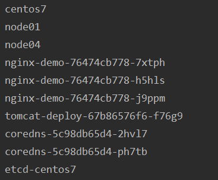

# Fabric8
fabric8是可以访问Kubernetes API的Java框架，通过api-server对资源进行增删改查。

在GetNodeInfo类中以获取nodeList为例，打印nodeNameList，顺便打印了podNameList。  
如下图：  
   
前三个是集群中存在的三个节点，之后是各个Pod  

# Client-Java
GetClient是用于创建Client-Java的类，输入MasterIP即可，要认证通过还需要一个token，暂时放在代码里了。   
