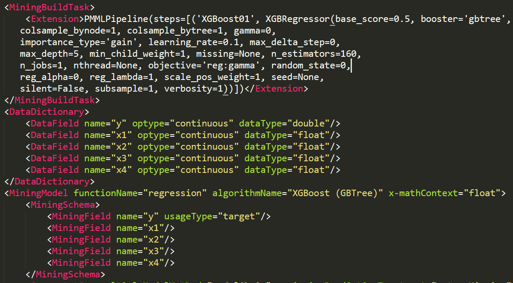

# PMML和调用机器学习模型
使用PMML保存XGBOOST模型，保存为.pmml文件，在Java Web中调用

1.通过PMML(Predictive Model Markup Language)工具，将在sklearn中训练好的模型生成
一个.pmml文件，主要包含了模型的一些训练好的参数，以及输入数据的格式和名称等信息。
  
在python代码中，model训练好之后加入如下两段代码即可：
```
modelPMML=PMMLPipeline([('XGBoost01',model)])
sklearn2pmml(modelPMML,'.\\XGBRegressor.pmml',with_repr=True)
```
.pmml文件部分内容如下
   
    
<br>
2.在Java Web项目中导入相关的包，读取.pmml文件，传入参数就可以预测。
（但是模型已经训练好了,不能在线调参）<br>
主要代码在utils包里的CallModel类中，从输入流得到模型，转化为Evaluator。在
modelPrediction方法中注入HashMap格式的参数，被service层调用，实现预测。返回预测到的
Qos（即往返时间RT）。

<br>

参考了https://www.cnblogs.com/baby-lily/p/10822048.html